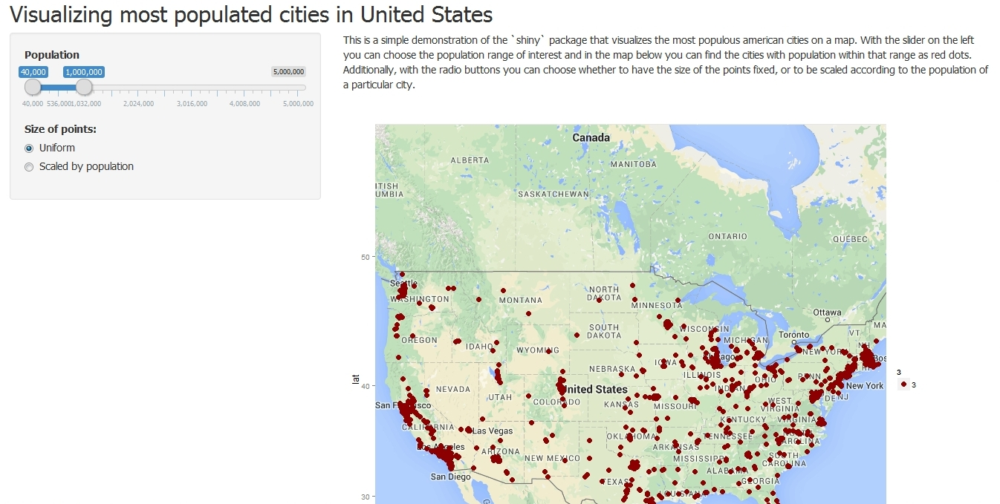

## Introduction

* This is a project for Coursera's "Developing Data Products" course
* It is a simple demonstration of the `shiny` package that visualizes most populous american cities on a map
* The user can select the range of population interested and the cities within that range appear on the map of US as dots

--- 

## Data set

* We'll use the `us.cities` dataset from the `maps` package 
   + It includes the US cities of population greater than about 40,000 (and state capitals of any population size)
   + It contains data such as population, location and state of a city
```{r, echo=FALSE}
library(maps)
head(us.cities)
```

--- 

## Getting a map

* We'll use the `ggmap` package for plotting maps
   + One starts by putting the GPS coordinates of the rough center of the US in vector called, say, `myLoc`
   + In the `get_map` function one the uses this as the location and specifies the type of the desired map, as well as the size
   
   ```
   myMap <- get_map(location = myLoc, source = "google", maptype = "roadmap",
                 crop = FALSE, zoom = 4)
   ```
   + This is then passed to the `ggmap` function, which creates the desired map as a ggplot object on which one can then put lines, dots and other graphical elements

--- 

## User experience 

* The user has a slider bar with which to select the desired size range
* The code then subsets the `us.cities` data according to this range and puts dots on the map at the locations of those cities
* The user can decide whether the dots will all be the same size or scaled by the population size
